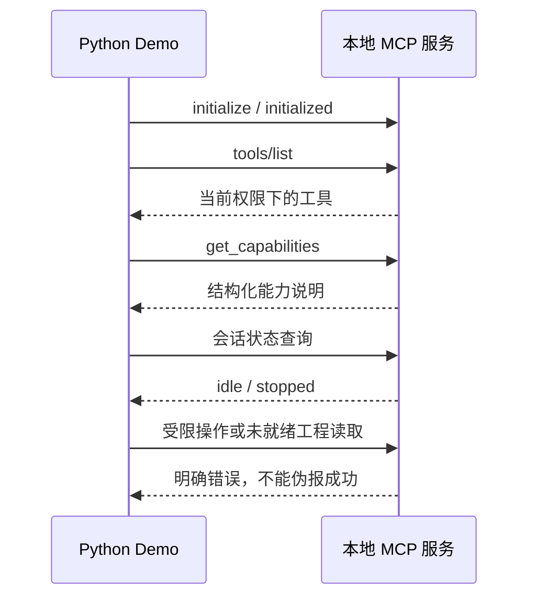

# 可运行 Demo：TIA Portal MCP

本示例启动仓库构建出的真实 MCP 服务，通过 stdio JSON-RPC 演示握手、工具发现、能力查询、只读限制和明确失败响应。不是预录响应或模拟 PLC。

## 一键演示

Windows、Python 3.10+、.NET 10 SDK、已安装 TIA Portal V21 Openness。构建仍引用本机 Siemens SDK；Demo 本身不会启动 TIA。若使用便携 .NET，先设置 DOTNET_ROOT 和 DOTNET_ROOT_X64。

在仓库根目录执行：

```powershell
dotnet build TiaAgentBridge.sln -c Release
python -X utf8 demos/run_demo.py
```

成功以 `DONE` 结束，失败返回非零退出码。脚本只使用 Python 标准库，创建独立临时状态目录并关闭自己启动的服务，不读取现有会话状态。

## 看演示结果

[完整实测终端输出](expected-output.txt)。工具数量会随版本变化；此文件由本次真实执行生成。



## 配合 AI 的提示词

> 请先查看 MCP 能力和当前状态，再列出当前可用工具。不要启动 IDE、打开工程或连接 PLC。指出哪些工程操作当前不可用，并依据实际返回值回答。

## 安装厂商软件后的工程演示路线

1. 使用 `--access engineering` 启动服务，显式打开测试工程。
2. 调用 `get_project_structure`，使用返回的精确路径读取目标代码。
3. 对完整源文件集合调用 `preview_engineering_change`，action 为 `write_source_batch`；按依赖顺序列出 sources。
4. 检查预览后，在同一会话使用令牌调用 `apply_engineering_change`。
5. 全部写入后调用 `compile`，传 plcName，不传 blockPath，执行整 PLC 编译。
6. 检查全部诊断，通过后 `save_project`。需要修复时集中修改并完整写入，再整 PLC 编译。

具体参数与限制见 [接口说明](../docs/V0.2_PARITY.zh-CN.md)。上述流程是操作指引，尚无完整批量写入的真实 IDE 验收证据。

若写入超时，先查询命令状态，不自动重发。以上演示不包含控制器下载、RUN/STOP 或实体设备动作，也不代表设备验收完成。
